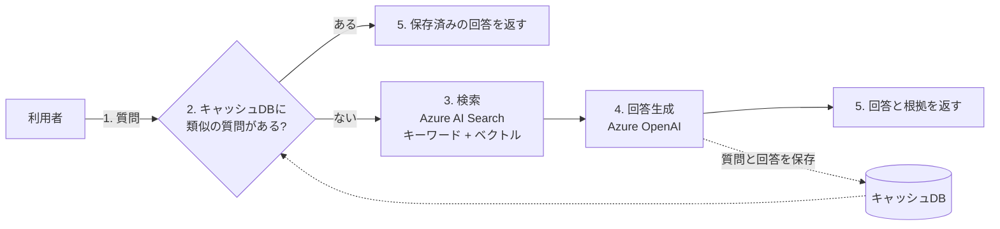
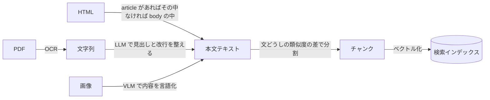

# AI エンジニア 5日間インターン 2026

5人チームで5日間、企業サイトのデータから社内の問い合わせに答える RAG を作り、
回答の精度と速度を改善したときの記録です。自分が担当した範囲と、そこで下した判断を残しています。

| 項目 | 内容 |
|---|---|
| 主催 | IT企業(インターンシップ。社名は伏せています) |
| 期間 | 2026年8月25日の週、5日間 |
| 形式 | 5人チーム。STEP1 技術選定(1日目午後) → STEP2 構築と改善(〜3日目) → 発表(4日目午前) → STEP3 拡張と業務改善の提案 |
| 題材 | 中途・新入社員が「欲しい情報」にたどり着くまでの時間を減らす、社内問い合わせシステム |
| 成果物 | 企業サイトの HTML を取り込んだ RAG(Azure AI Search + Azure OpenAI)。STEP3 で PDF と画像に対応 |
| 自分の担当 | HTML からの本文抽出(前処理)、PDF・画像への対応(OCR / VLM)、スコアの低い設問から原因を追う進め方の提案 |
| 結果 | STEP1 は4位以下。STEP2・STEP3 はチーム総合1位 |

> コードは主催元の環境と配布物の上に書いたものなので、このリポジトリには含めていません。今後も載せません。
> 他のメンバーが作った資料も含めていません。数値はチームの発表資料から引いています。

## 課題設定

**背景**: 中途・新入社員には「これが欲しい」がはっきりある。一方で、サイト内検索では
欲しい回答にたどり着くまでに時間がかかる。

**方針**: 回答の精度と速度の両方を重視する。

**評価**: 5つの指標の加重平均を総合スコアとする。Contextual Recall・Correctness・
Contextual Precision が重み2、Faithfulness・Answer Relevancy が重み1。
配布されたサンプル実装の初期値は総合 0.567、20問の回答に 123.9秒(1問あたり約6秒)。

## 進め方

| 段階 | やったこと | 自分の担当 | 結果 |
|---|---|---|---|
| STEP1(1日目午後) | 自社サーバー / クラウド / OSS を比較し、RAG とハイブリッド検索を選定。LLM に詳しくない相手に向けて技術選定を説明する | 技術の調査・比較と、選定パートの図 | 各技術の深掘りに時間を使いすぎ、資料が検討過程の羅列になった。4位以下 |
| STEP2(1日目午後〜3日目) | 作業を細かく分け、時間を区切る形に立て直した。配布されたサンプルで20問を評価し、スコアの低い問から原因を追う。前処理 → チャンク分割 → キャッシュ → パラメータの順に足して、そのたびに20問を再評価する | 進め方の提案、HTML の本文抽出。チャンク分割・キャッシュ・パラメータ調整は他のメンバー | 総合 0.567 → 0.801 |
| 発表(4日目午前) | STEP2 の結果を発表 | 資料はチームで分担 | |
| STEP3(4〜5日目) | PDF と画像を取り込めるようにし、想定質問21〜25を1問ずつ確認しながら精度を上げる。業務改善の提案をまとめる | PDF・画像への対応(OCR / VLM) | 想定質問21〜25で総合 0.868 |

修正のたびに20問を全部評価し直したので、どの変更がどの指標を動かしたかが表に残っている(下の「数字で見る」)。

## システムの流れ

質問を受けてから回答を返すまでの流れ。STEP2 で回答キャッシュを足し、
類似の質問が登録済みなら LLM を介さずに返すようにした。

データの取り込み側。STEP2 では HTML だけ、STEP3 で PDF と画像を足した。
自分が書いたのは HTML の本文抽出と、PDF・画像の2経路。

## 自分が担当した範囲

### HTML からの本文抽出(STEP2)

- **やったこと**: 企業サイトの HTML から本文だけを取り出してテキストにする前処理を書き直した
- **困難**: 20問の平均スコアを見ているだけでは、どこが悪いのか分からなかった。配布されたサンプルは
  article タグの中だけを本文として取り込んでいて、article を使っていないページ(チーム紹介、歴史など)は
  本文が空のまま登録されていた。そのページに関する質問には、検索の調整をいくら足しても答えられない
- **解決**: スコアの低い問から1問ずつ原因を追う進め方を提案し、該当ページの本文が空であることを突き止めた。
  article があればその中を、なければ body の中を本文として抽出する形に変え、すべてのページの情報を
  LLM が参照できる状態にした
- **効果**: 前処理だけで総合 0.567 → 0.666。この後のチャンク分割やパラメータ調整は、
  取りこぼしのないデータの上で効くようになった

### PDF・画像への対応(STEP3)

- **やったこと**: STEP2 まで HTML のテキストしか扱えなかったシステムに、PDF と画像を取り込む経路を足した
- **困難**: PDF は OCR で文字を取り出せても、改行や見出しが崩れたまま登録すると検索に効かない。
  画像は OCR にかけると組織図の階層(部門と部署の親子関係)が失われ、文字の羅列になった
- **解決**: PDF は OCR(Azure Document Intelligence)のあとに LLM で見出しと改行を整えてからチャンク分割する。
  画像は OCR をやめ、VLM に内容を言語化させて階層ごと文章にする方式に切り替えた。
  想定質問21〜25を1問ずつ確認しながら直し、総合 0.68 → 0.868 まで上げた
- **結果**: 想定質問21〜25で総合 0.868(Contextual Recall 0.980 / Correctness 1.000 /
  Contextual Precision 0.600 / Faithfulness 1.000 / Answer Relevancy 0.880)
- **限界**: VLM は画像を一般的に説明するだけで、顔を個体として識別しない。ナレッジベースにない写真の
  人物は特定できなかった。改良案として、画像を「人」か「人以外」かで分岐し、人は顔照合に回す構成を示した

## チームで実装したもの(担当外)

- 文どうしの類似度の差で切るチャンク分割(0.666 → 0.675)
- 回答キャッシュ DB。類似の質問が登録済みなら LLM を介さず返す。関連データが20件あるとき
  1問 6.19秒 → 1.51秒(最大76%短縮)。関連データが0件のときは逆に15%遅くなる
- 埋め込みの次元数(3072 / 1536 / 768 で差がなく、下げてコストを減らせる余地)、
  ハイブリッド検索の重み、Top-K、プロンプトの調整

## 業務改善の提案(STEP3・チーム)

キャッシュ DB は、1つに全部署の質問を集めると照合する件数が増えて遅くなる。そこで、会社サイトの情報を置く
共通 DB と、部署の中だけで共有したい情報を置く部署別 DB に分け、利用者が納得しなかった回答は人が修正してから
キャッシュに反映する構成を提案した。分けた構成は集約した構成より応答が遅くなることを計測で確かめたうえで、
キャッシュに当たる質問が増えれば通常の RAG より速く、部署単位で情報を扱える利点が上回る、という提案にした。

## 数字で見る

| 段階 | 総合スコア |
|---|---|
| 配布されたサンプル | 0.567 |
| 本文抽出(担当) | 0.666 |
| チャンク分割 | 0.675 |
| STEP2 最終 | 0.801 |
| STEP3 想定質問21〜25 | 0.868 |

STEP2 の最終値では、Contextual Precision が 0.500 → 0.943、Faithfulness が 0.860 → 0.946 まで上がった。

## できなかったこと

- 時系列の質問(「最初」「最後」「最も新しい」を問うもの)は未対応のまま。該当する問のスコアは 0.175〜0.212。
  日時の情報を context として渡す改良案は出したが、実装には至っていない
- STEP3 の全体精度(問題1〜20を含めた再計測)は時間切れで出せていない
- 複数の記事を比較・集計する必要がある質問には誤答する

## 振り返り

**課題**

- 日時の情報が取れていない問題に気づいていたが、資料の進捗を優先して共有しなかった。
  360度フィードバックで「遠慮して話さなかった」と指摘され、翌月の
  [NTTドコモ ハッカソン](https://github.com/Natto2026/docomo-hackathon-2026) でも同じ指摘を受けた。
  技術で貢献するのは正しいが、それを理由に議論から引かない。方針だけでも確認する
- STEP2 の資料が完成したのは提出の5分前。STEP1 の反省のあとも時間配分は甘かった

**学んだこと**

- 設定より先に、入力が欠けていないかを疑う。前処理を直しただけで総合スコアが 0.1 上がり、その後の調整は
  すべてその上で効いた。平均だけを追っていたら気づけず、1問ずつ見たから分かった
- 手段に固執しない。画像は OCR で読めるはずだと決めてかかると、階層が失われる。
  目的(構造ごと検索できる文章にする)に戻って VLM に切り替えた
- 相手に合わせて説明する。STEP1 で伝わらなかった反省から、STEP2 以降は
  「LLM に詳しくない相手に伝わるか」を基準に資料を作り直した

## 技術構成

| 層 | 採用したもの | 理由 |
|---|---|---|
| 検索 | Azure AI Search(ハイブリッド検索) | キーワードと意味の両方で当てる |
| 生成 | Azure OpenAI | 配布された環境 |
| PDF | Azure Document Intelligence(OCR) + LLM での整形 | 文字を取り出したあと、見出しや改行を整えてから分割する |
| 画像 | VLM による言語化 | OCR では組織図などの階層が失われる |
| 評価 | 5指標の加重総合 | 配布された評価基盤 |
